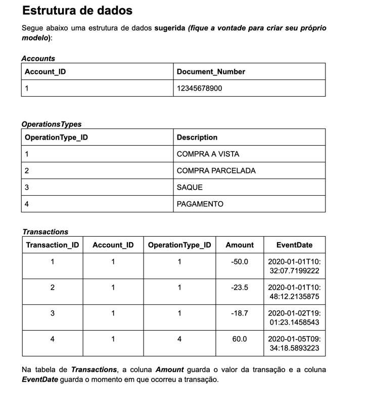

<h1 align="center"> Projeto Pismo </h1>

##Project

Pismo evaluation project.

Where the goal is to create a card payment system



##Configuration

To run the docker-compose, you will need to generate a updated Jar.
```bash
./gradlew clean bootJar
```

After generate the Jar, you can run the docker-compose file.

The docker-compose will automatically run the PostgreSQL and populate the
database with some datas to test.

```bash
docker-compose up --build
```

The "--build" flag will rebuild the containers with any new changes. 
To update the code, you must first recreate the artifact then run docker-compose up --build.

For checking the status of the application, you need to surf this link in the 
browser (or Postman): http://www.localhost:8080/health and the 
response is "Up"

##Tecnologias Utilizadas
Java 17

Springboot

Swagger

Junit

Docker

Docker-compose

PostgreSQL